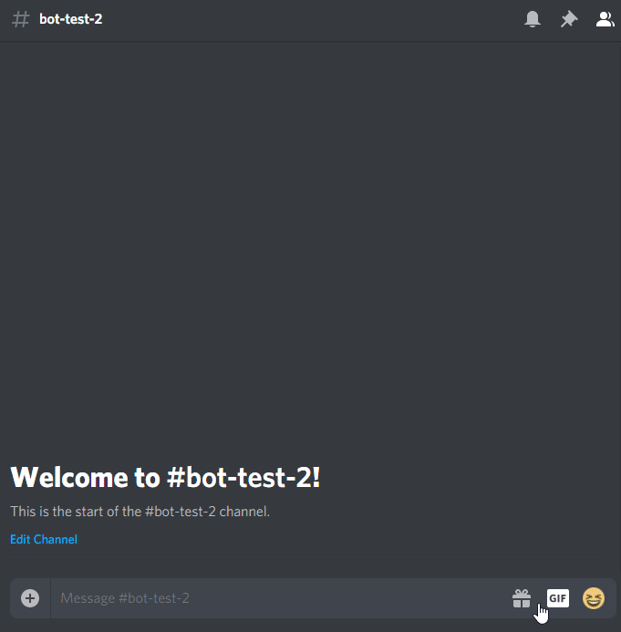

# PSBot
 Multi-functional Discord bot aimed at PlayStation Gamers.
 
 Written in Python 3.7.1 using Discord's latest bot API.

## Features
* Searches for trophy lists, game sales, scores and lengths utilizing Google Search for maximum accuracy.
* Allows users to register and become recognized by the bot.
* Error handling.

## Initialization
1. [Download latest ZIP](https://github.com/liav22/PSBot/archive/master.zip) and exctract to any folder
2. Ensure you have Pyhon 3.7.1 and the required packages (see beginning of all `*.py` files)
3. Edit `config.ini` with the following:
   * Bot token - copy from [Discord Developer Portal](https://discordapp.com/developers/applications/)
   * Prefix - default is `~` but you can change it to whatever you like
   * Status - text message that the bot will show next to a "Playing" tag (default is "Use ~help")
   * Owner - Bot Owner's Discord ID (only needed for the `~restart` command).
4. Launch `main.py` with Python 3.7.1 using your system's console / terminal
5. Add bot to your server of choice by generating a OAuth2 URL from [Discord Developer Portal](https://discordapp.com/developers/applications/) with the "bot" option checked and open it in your browser.

## Usage
* Type `help` (with set prefix) in any Discord channel (the bot needs basic premissions) to see the command list.
* Any unknown error (should only be AttributeError) will be printed to console / terminal.
* User data is stored locally on `*.CSV` files in `userdata/`.

## Preview

